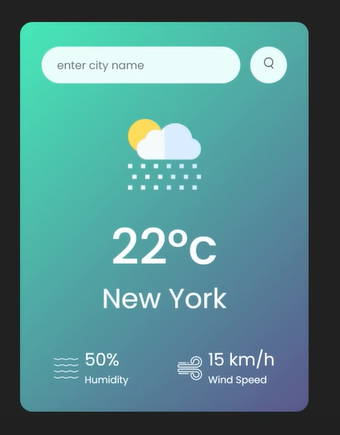

To make this project we need a input tag for search query, search icon, weather icon, p tag for temperature and location.

we will make an api call using fetch and display the infor in our app.

We want to show dynamic data according to the city so we are taking city name from input tag to our checkWhether function and adding it in the API URL.

Now we use if condition to change the Image in the app based on whether condition.

Inside the image src we will add icon based on weather info

Initially we only want to show an input box and search bar and as soon as user enter details and clicks it, we will show the weather details for that city so we make display: none for div and change it dynamically using js

If we enter wrong city name, it should show error message so we create another div for that with p tag and make its display:none as we need to only show it if user enters wrong city
