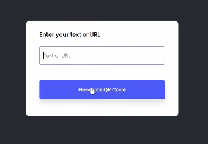
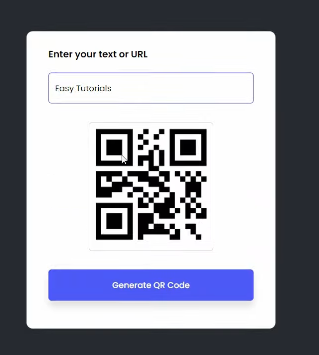
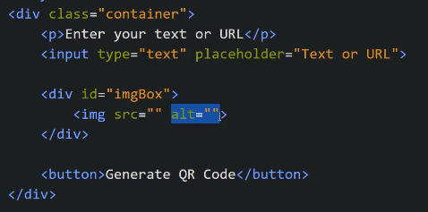
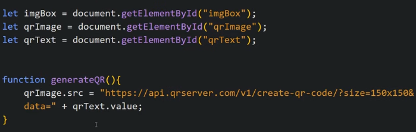
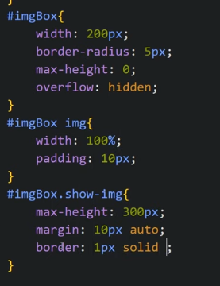
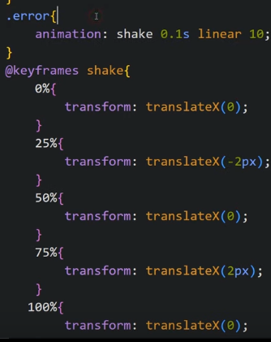
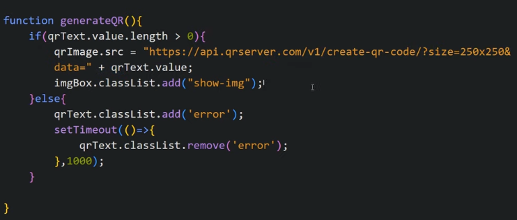

We have a input box where if we write some URL or something, it creates QR code of that text or URL.

Our HTML looks like

Now we write JS

We will use QR Generator API to generate QR code

We want to show an animation while showing the QR such that we initially give max-height = 0 to QR box and then when QR comes, we increase it to 300px by adding a class show-img in it.

if text is empty, we handle it like

