We have 3 buttons, On pressing them we get toasts

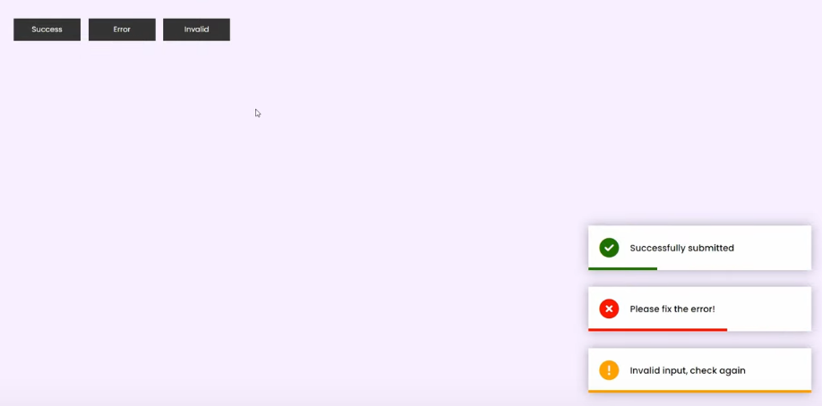

Our HTML looks like

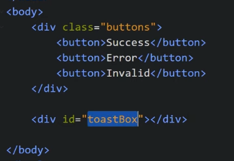

Toast will come at right side bottom corner so CSS for it will be like:

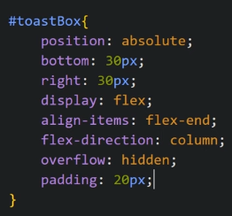

Now let us add onclick for the buttons

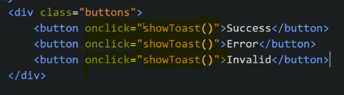

Now Let us add JS

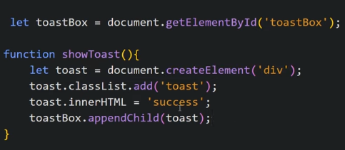

Now we design these notification tags

We need to show modified content of the toast based on button we press so make another variable successMsg, errorMsg, invalidMsg

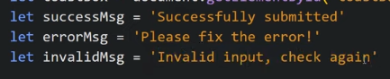

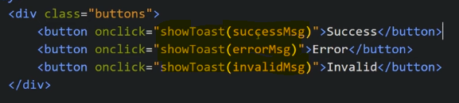

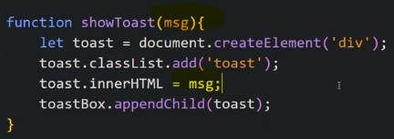

Now we add icons using favicon

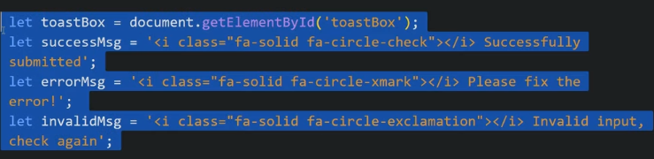

We need colour of favicon to be based on button pressed so we add classes for it

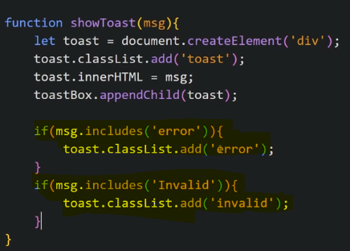

We need to hide a notification after certain time so we add setTimeout()

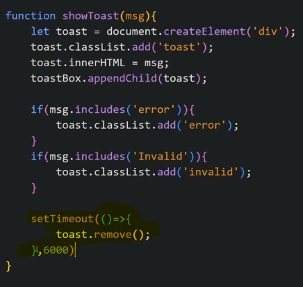

We need to show a progress bar below each toast so we add CSS for that, we make .toast as position:relative and we make .toast:after as position:absolute

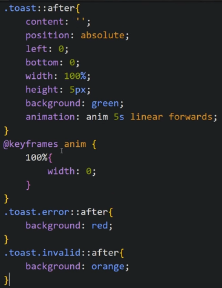

We want toast to slide to left and vanish on finishing so we add CSS for it

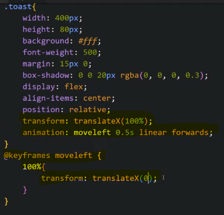
