We can play, pause, swipe the progress bar anywhere

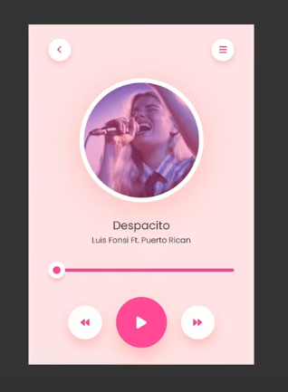

HTML looks like

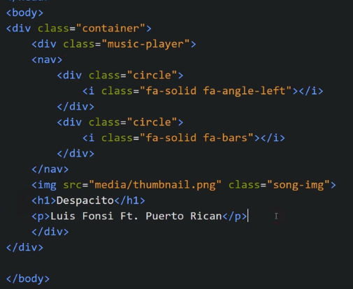

For audio

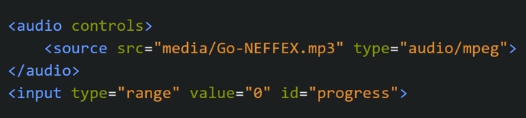

To design the progress bar and that circle in the slider

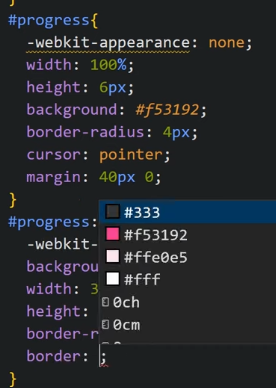

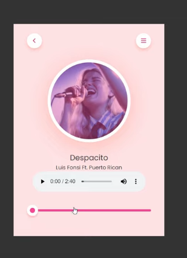

Now we put control, forward, backward, play, pause. For icons we use fontAwesome

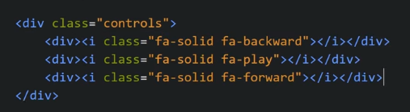

We style them

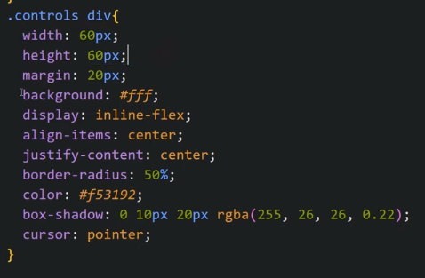
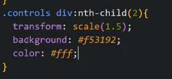

Now we add JS
We add id to the play/pause button and slider

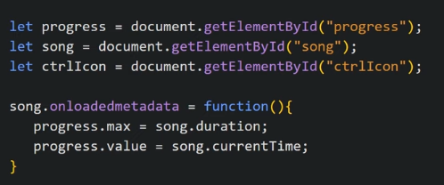

Now we add play/pause functionality, for that we give onclick to button

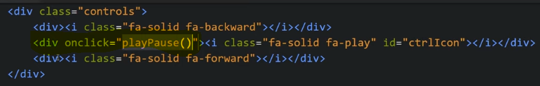

We dynamically add fa-pause/ fa-play class to the icon to change it

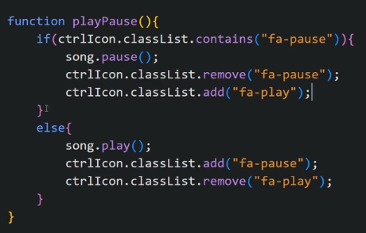

We want to change value of slider based on song

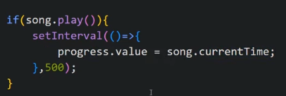

Now we want to click anywhere in prgress bar and change song duration and song

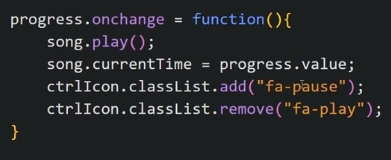
