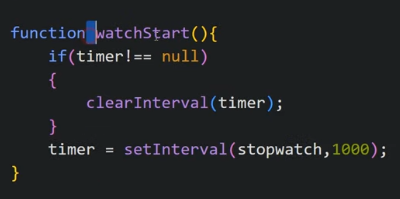
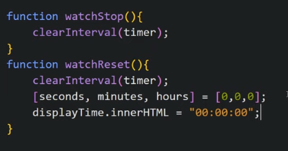

Stopwatch which play, stop, reset the timer

Our HTML looks like

CSS looks like

Now we write JS

We give id to h1 tag to show time using JS

JS looks like

Now we want to execute stopwatch() every second for which we use JS setInterval

We need to take care that if timer is already running then we need to clear it our first so we make a timer variable

Now we make a function

We want this timer to start when we click start button so we give it as onclick to start button

Now we want to update the display time everytime and we need to take care that our time should come in 00:00:00 format means double 0 format so we need to take care of 0 to 9 digits so we put condition for it

Now we add functionality to stop or reset the timer so we make a function and give it as onclick

