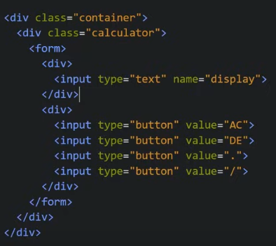
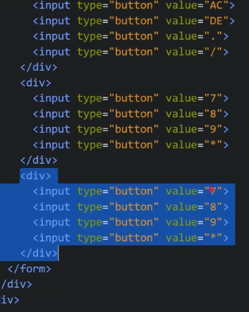
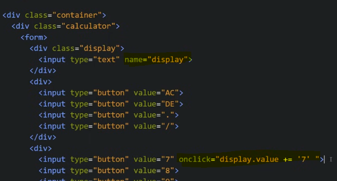
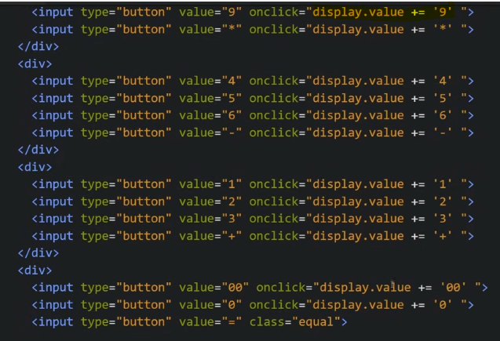
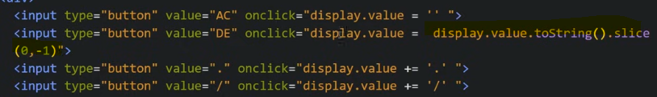
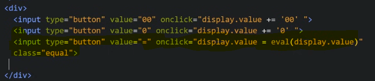

Calculator App using JS

Our HTML looks like

Now we need to show the number when we click on it to our display
We give name attribute to our input tag for display
So we give it like this

We do this for all buttons

Now we add click function on AC, DE, \* etc buttons

For DE button we need to delete only last number so we use slice method

Now we put click function on = button for that we use eval()

