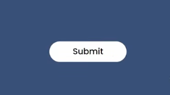
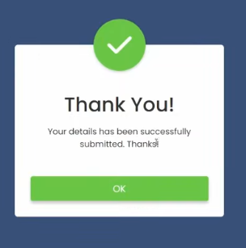
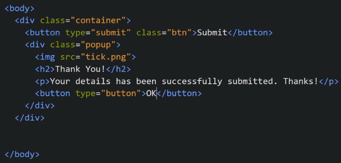
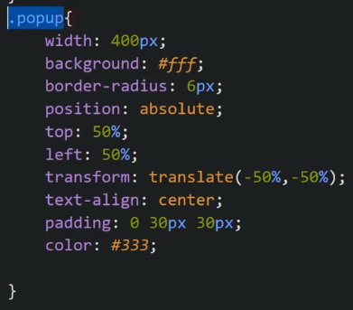
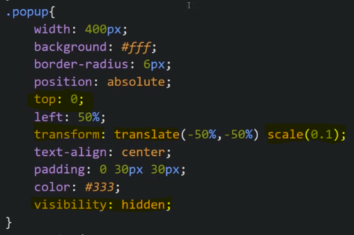
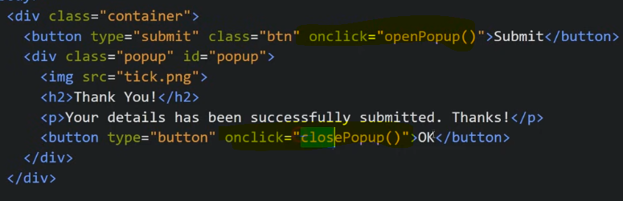
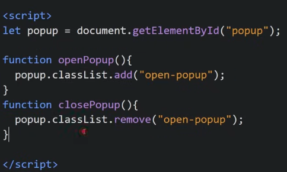
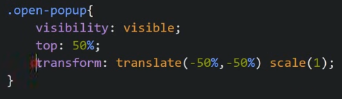

We have a button, On pressing which we show a popup with a animation and when we click OK on popup, it vanishes

Our HTML looks like

Now we style our popup

We want our popup to start as very small in size and from the top and get bigger as it comes to center and it should come from top to center so in CSS we give top:0, translate:scale(0.1) initially and we will change it using animations and we will show it only when we click "Submit" so initially we keep visiblity:hidden

We give onclick function to buttons

Now we write JS

We will give a class to our popup using JS

