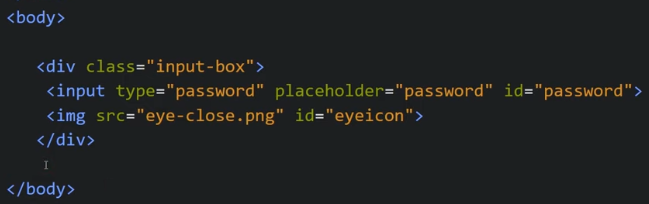
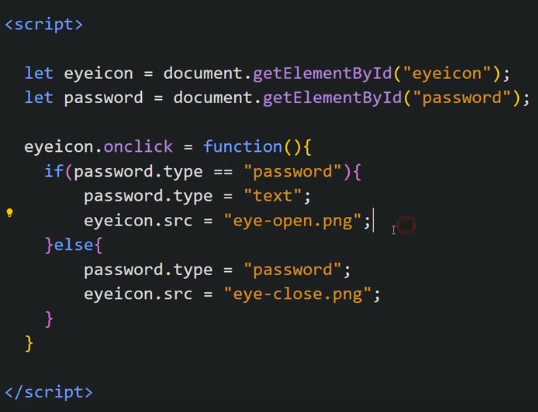

Show or Hide Password using JS where icon is also changing

Our HTML looks like

Now we write JS

To make the functionality we need to play with type of input field, it type of input field is "password" then it will show ...... form and when its type is "text" it will show in normal form

