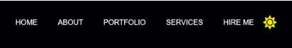
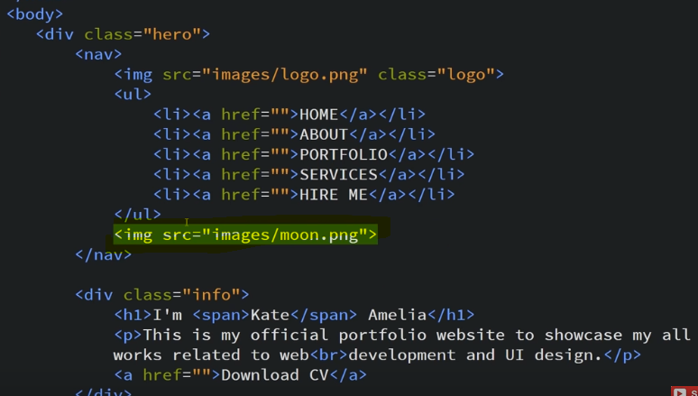
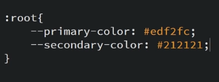
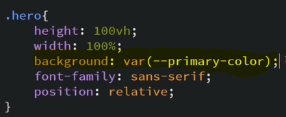
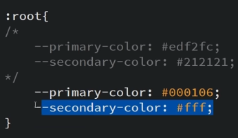
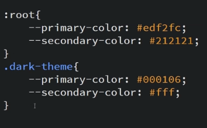
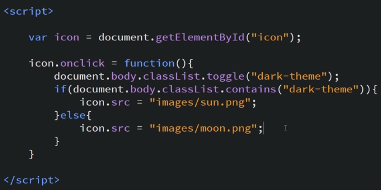

Dark Mode / Light Mode in JS

Our HTML looks like

We have png files for moon and sun image

Now we give id to that icon

Now we make variables where we will store the colour hex code for the website and we pass those variables where we have given the background

We have done this so that whenever we change the colour we do not need to do it for all elements individually, we will just change the value for the variable and it will change for all, like this

So we make a class named dark-theme

Now we write JS

