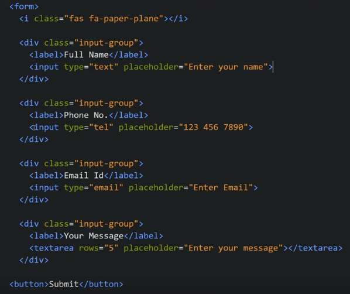

Form Validation Using JavaScript
Gives green check mark if field is correctly filled, name should have both firstname + " " + lastname
PhoneNumber should be 10 digit number
Email id should have proper email format and so on

Our HTML looks like

Now To add error message for each input field, we add span tag

Now we add CSS to these error messages

Now we add error messages using JS

We give id and keyUp event to input field

Our JS looks like

To validate Name, we use regex

Instead of valid, we want to show check icon

Sameway we do for contact number, email and message

Now we add Validation for the submit button

We want to hide the submit error message after sometime so

