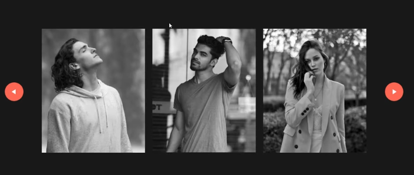
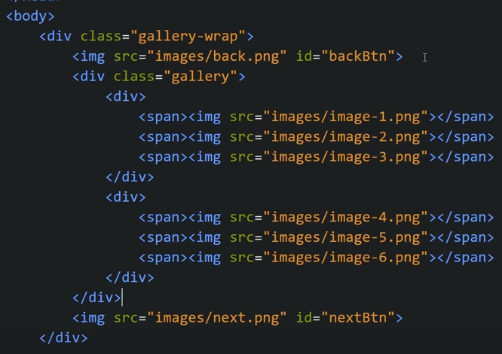
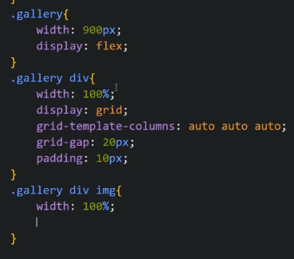
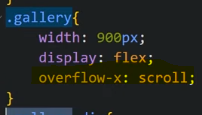
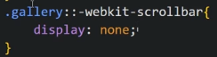
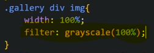
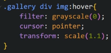
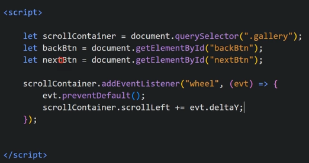
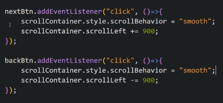

Create Image Gallery In JavaScript || Horizontal Scrolling
It contains slider buttons or we can also scroll horizontally using mouse wheel and when we hover on any image, it becomes colourful

Our HTML looks like

Our CSS

To hide that horizontal ScrollBar

To make all images Gray, we use grayScale property

On Hover we change it

Now we want to give horizontal scoll using mouse wheel so we write JS

Now we add click feature on Back button and next button. To make scrolling behaviour smooth we use below attribute

