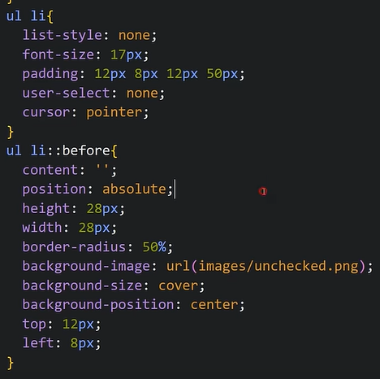

TODO List App in which we can Add, Delete or mark completed to any task

We can also save the tasks in browser so that if refresh screen, it does not change the UI, we will use local storage for this purpose.

To write tasks and add task we make input tag and button

To show the list of tasks we use ul and li

To Show circle before all lists we will use pseudo selector ::before

Now when we click the circle it should get selected
