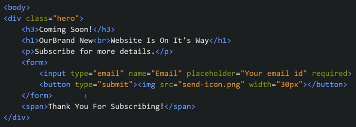
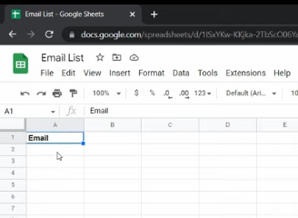
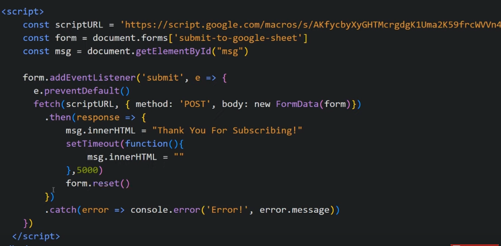

Email Subscription Form With Google Sheets
We Enter the email, we get message, Thanks for Subscription and then the Entered Email Id gets saved inside a Goggle Sheet

Our HTML looks like

Now we go to the goggle sheet and make one sheet

We give Field Name of Goggle Sheet same as name of our input attribute that is "Email"

We need to write scipts on goggle sheet, after which we get URL

We give name attribute to our form i.e "submit-to-goggle-sheet"

