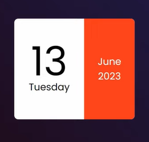
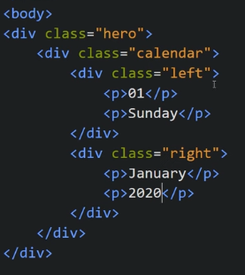
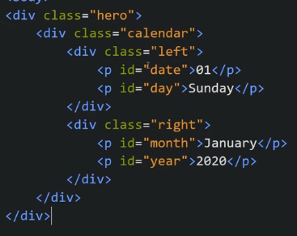
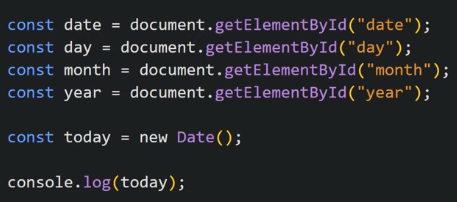
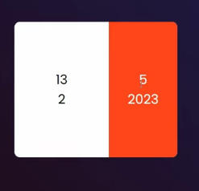
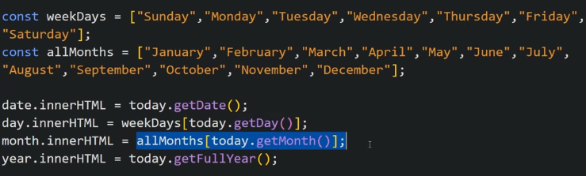
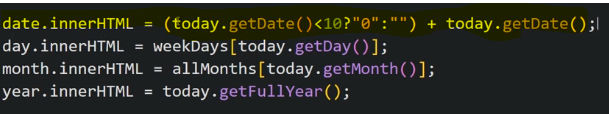

Mini Calender
It displays the current date, month and year

Our HTML looks like

Now we display date, month, day, year dynamically using JS so we give id to all divs

We see that the calender is showing month, days in terms of index so to make it show in terms of text we make an array

Now we want to show double digits for 0 to 9 like 01, 02... number also so

