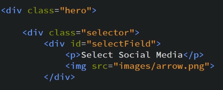
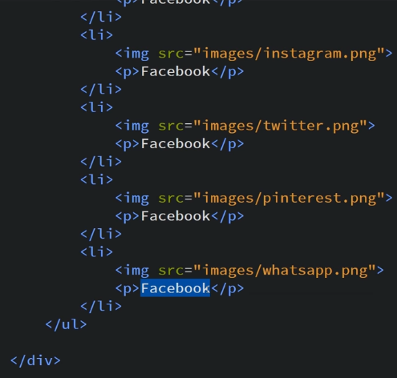
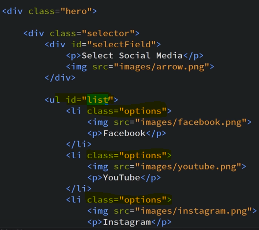
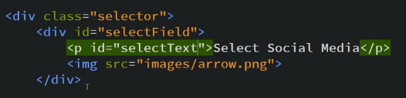
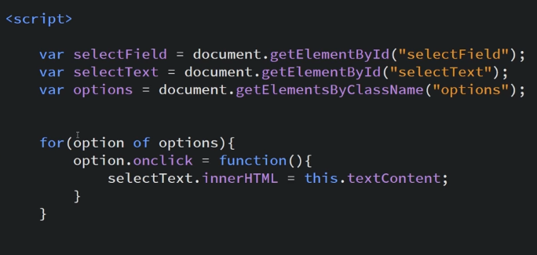
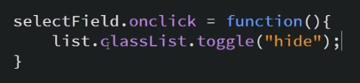
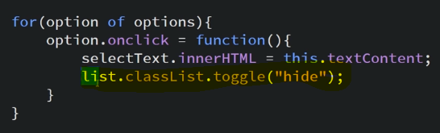
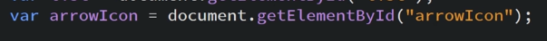
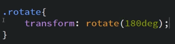
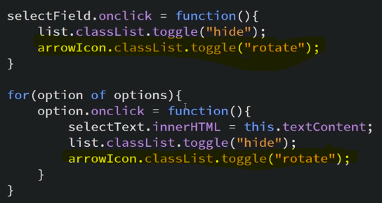

Dropdown Menu
Whatever we select gets selected with an arrow animation

Our HTML looks like

To show options we use <ul> and <li>

Now we add id and classes to the options

Now we write JS to apply click event on the options

We give id to select items tag

To make click functionality

Now we want when we select something dropdown menu should automatically close

we add className to ul tag and make its visiblity hidden and we only make it visible when we click select field tag

So we make a class .hide to show visblity=hidden and we toggle it onclick

Now we want to apply same feature when we select any option so

Now we rotate dropdown icon based on opening or closing of dropdown menu

We make a class .rotate

Now we toggle this class

