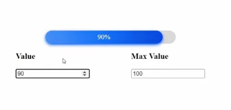
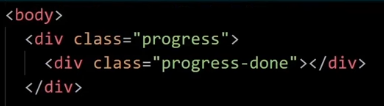
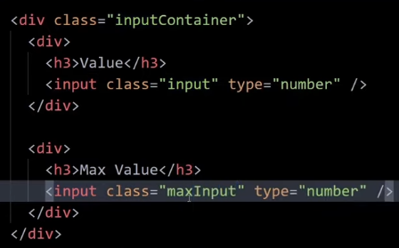
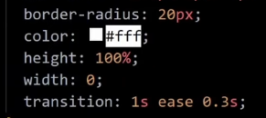
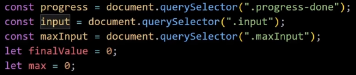
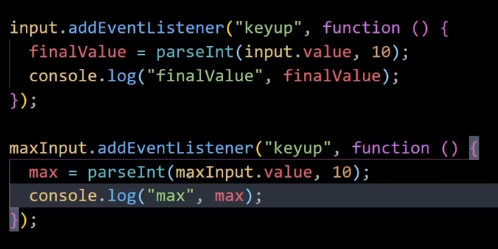
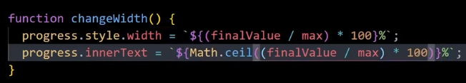
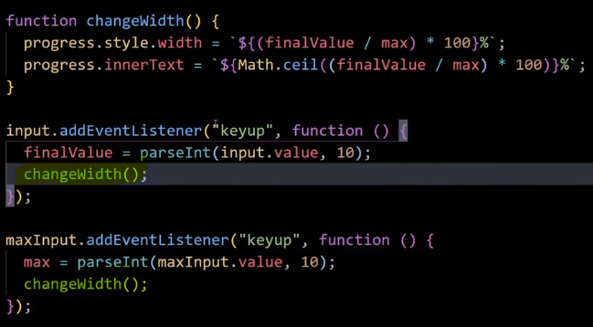

Progress Bar
This progress bar where we give value and max-value, based on value it changes dynamically. Whatever be the max-value, value will be % of it.

Our HTML looks like

We make 2 classes, progress which shows an empty bar, and progress-done which shows the progress done above progress bar, initially we give width:0 to progress-done
To get that animation in progress bar, initally we set the width to 0 which we change using JS based on %age

Now we write our JS

Now we take input and max-input

Now we make function to change width of progress bar and can what %age of max-value is value

Now we want this function to get called everytime we change the input

