Digital Clock

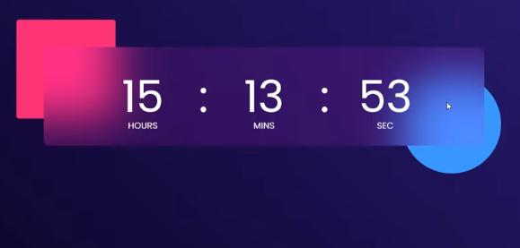

Our HTML looks like

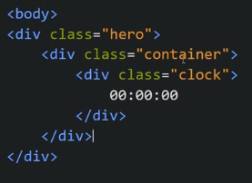

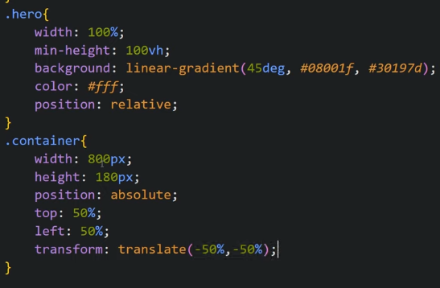

To get below effect we make container::before and container::after

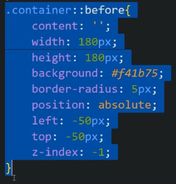
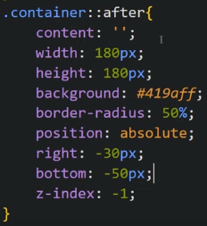

Result

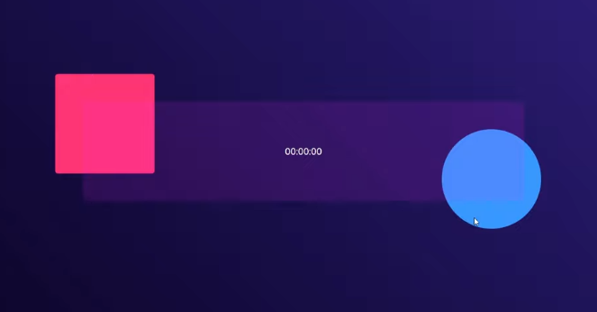

To make the clock blur, we give backdrop-filter

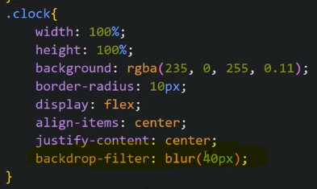

Now we style 00:00:00 part of clock so we give span tags

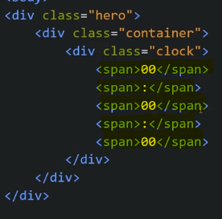

We give ids to them so that we can change the text accordingly

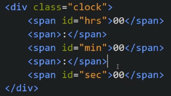

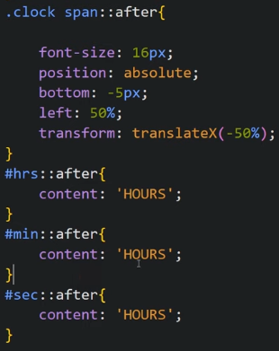

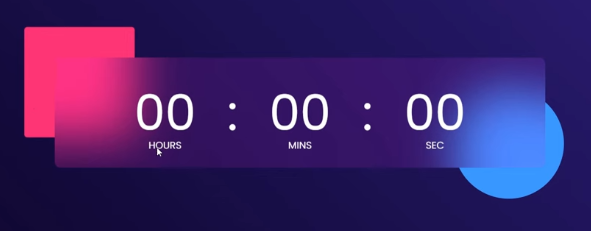

Now we add JS

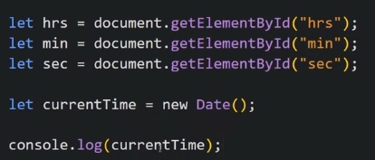

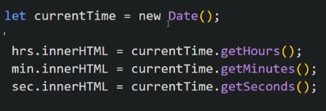

But this time is static and we want it to change every second so we put everything inside setInterval and put timer of 1sec

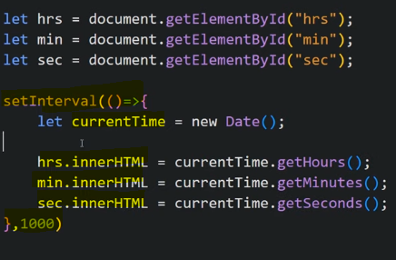

To make digits like 00, 01.... for <10 we do

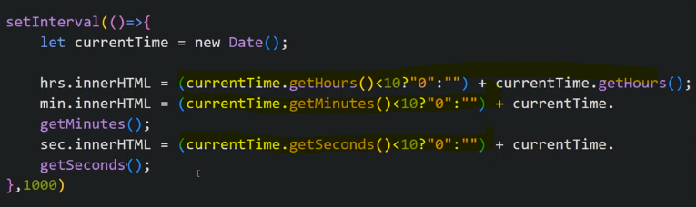
