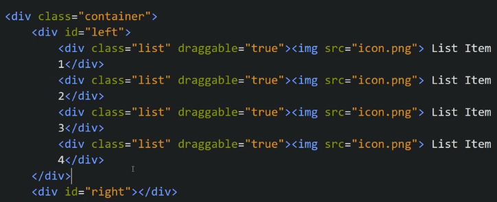

Drag and Drop Functionality
We have 2 boxes and we can drag and drop elements from left-box to right-box or vice-versa

Our HTML looks like

To show list items we make them draggable=true

Now we write JS to be able to drag and drop items from left to right or vice-versa

We apply a listener for "dragStart" for all items of list and we put "dragOver" and "drop" event on right box so that we can drag and drop items from left to right

Now to be able to drag and drop from right to left. we copy same code in same loop after above code

