Image Search Engine

We have a Search bar where whatever we write we get images related to it in result and we have a show more button in the bottom of page when we click it, we see more results

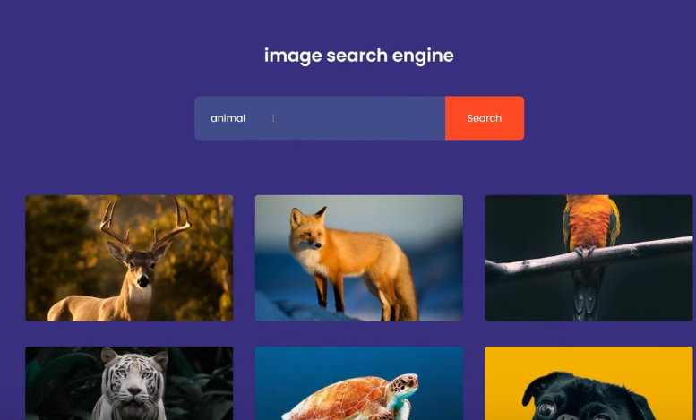
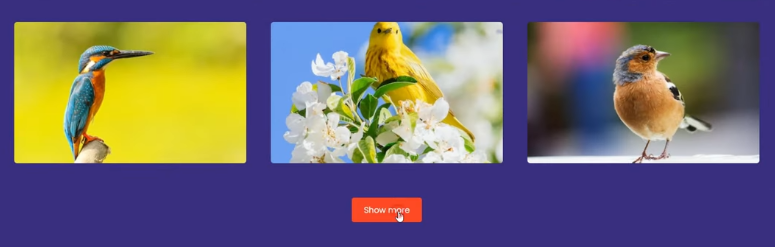

Our HTML looks like

We will show search result inside search-result div

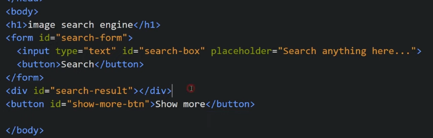

Initally we will keep Show More button as hidden and will show it only when we have the API data

Now we write JS and we use unsplash API to get the images

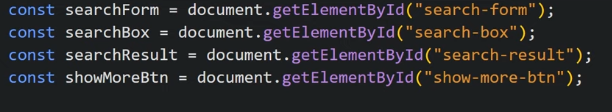

Inside unSplash API we have certain parameters like query, page, pageperLimit etc to get the desired search result

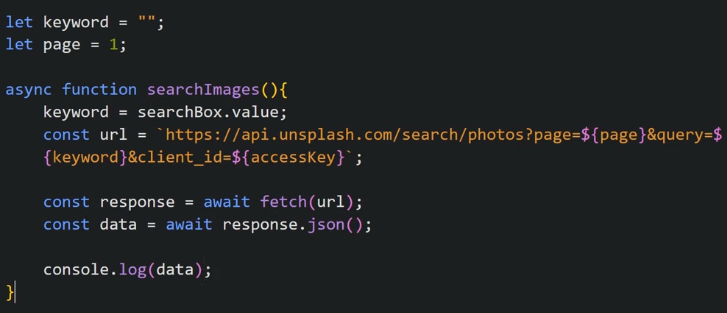

We will call this function when someone submits the form so we add a listener to the form for onSubmit

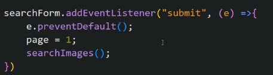

Now we show the result when we get the data from the API and we make <a> to make image connected to a link and we make target = \_blank so that image opens on new tab.
we place our img inside <a> tag and we put <a> tag inside our div search-results

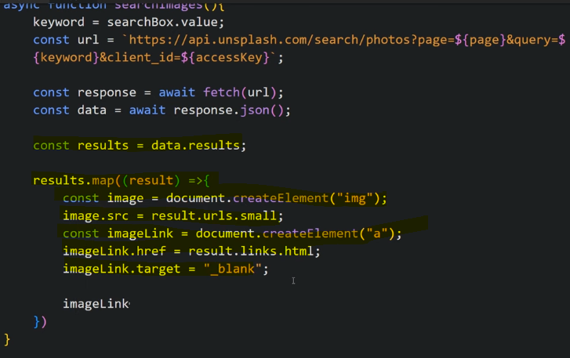
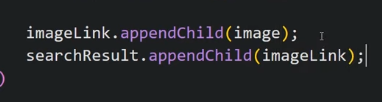

Now we show "Show More" Button
so we put its display:block
and we want to load more images on clicking it we do it by showing result from other pages so we do pages++

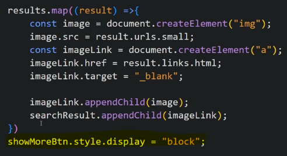

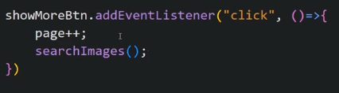

We want to hide previous result when we are entering new result

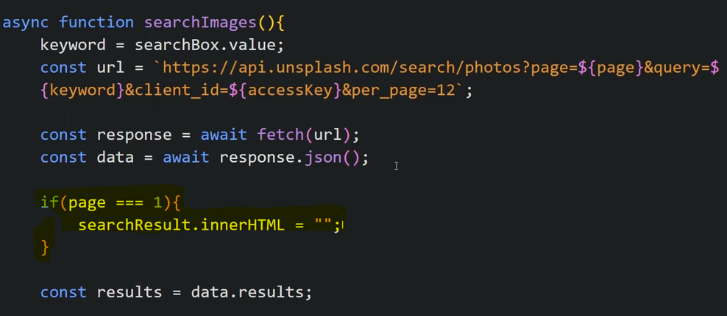
