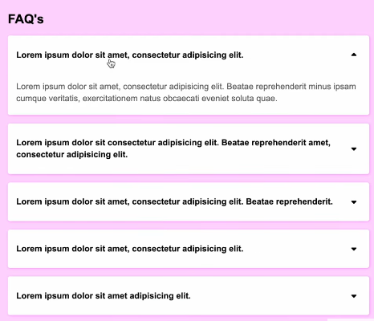
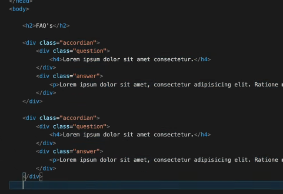
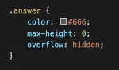
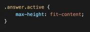
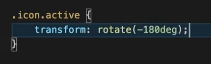
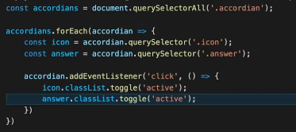
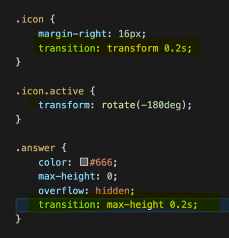

Animated FAQ Section
Collapsable accordian

Our HTML looks like

We are using font Awesome for the arrow icon

Our JS looks like

When we collapse our accordian, we give it max-height:0 and overflow:hidden

and when we expand it, we give max-height:fit-content

Same for icon we need it to rotate 180 degree

we have given .active class so when we give .active class to any element we see the above functionality been applied to it

So we want to do same thing using JS

Now we want to put animation in accordian while expand and collapse

