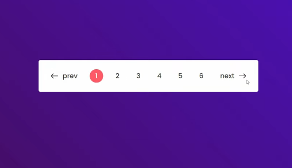
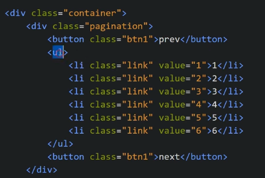
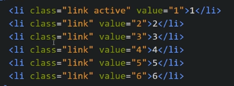
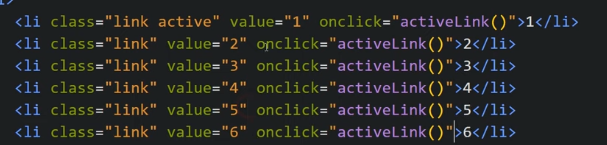
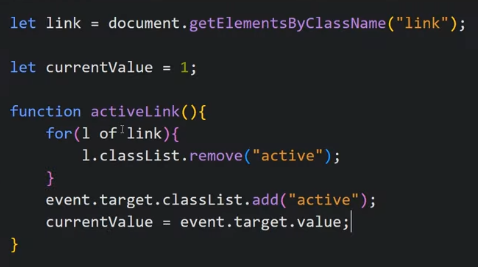
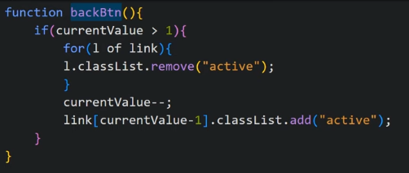
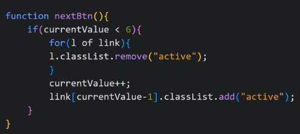

Target: 

Our HTML structure looks like:

We will add active class in one of the li
Now we will give some style to li.active so that whichever li has active class, we can show animation in it.

We will now put active class to li based on clicks using JS

We make variable activaLink = 1 as active class is on first link currently

We make activeLink function which does the work for us.

Now we put backBtn() and nextBtn() function on click of next and previous button

For previous button

For next button

