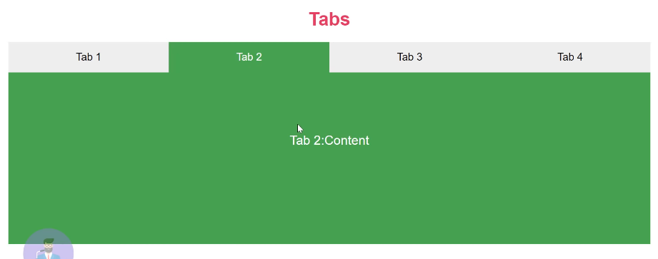
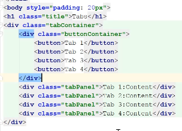
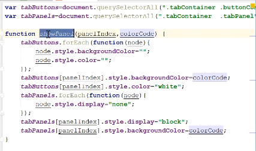
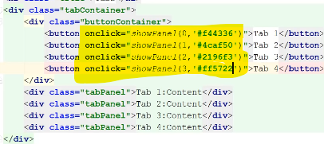
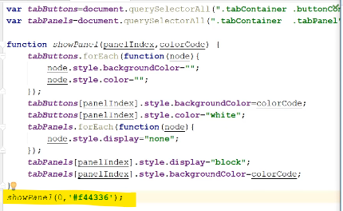

Tabs Functionality
We have different tabs and each tab has different content with different colour, we can switch between tabs.

Our HTML looks like

Our JS looks like

We will grab the tab button and content area called tabPanel first

Now we make a function showPanel where we give panelIndex and Colourcode, we run a loop for each tab button and we first reset the tab background colour and text colour to null, we set background to Colourcode, colour to white
Now we apply loop for each tabPanel and we make its display:none initially, then we set its background and make its display:block

Now we give showPanel() as onclick to each tab button

To by default call first index, we do this in our JS file

