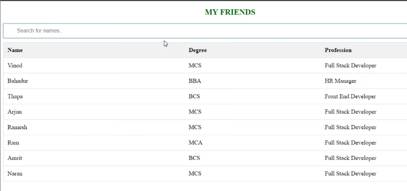
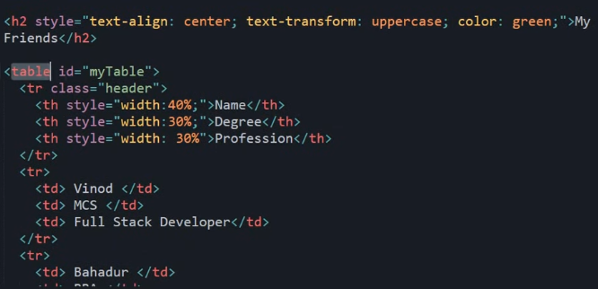
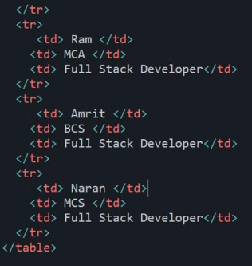
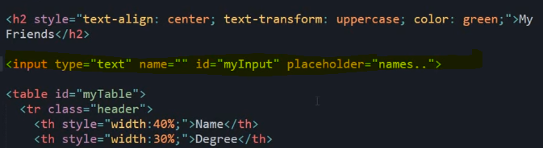
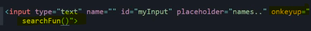
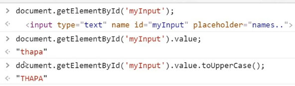
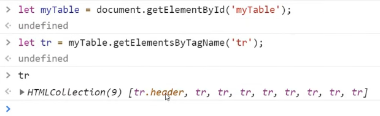
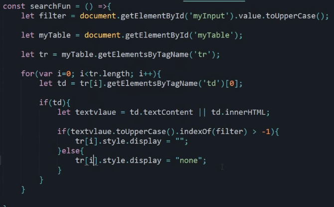

Search Bar & Filter Table
We have a Table with some data and we have a Search bar, we write something on search bar and show result in the below table

Our HTML looks like

First we make a Table

Now we make our Search bar

Now we apply "onKeyup" event and we call a function searchFun()

Now we define the function

We can access our input and its value like this

To get values inside tr of our table we do something like this

We have got collection of all tr now we apply for-loop for each tr and get "name" field from that tr and to get textValue, we use textContent, we convert it to Uppercase so that matching is easy.

indexOf gives index of first occurence of that thing if its present or it gives -1 if its not present

Our complete function looks like

