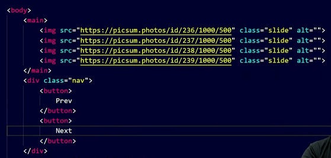
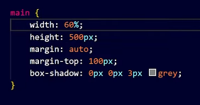
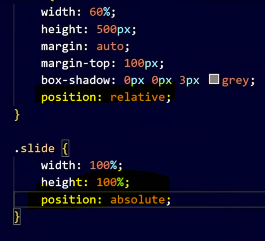
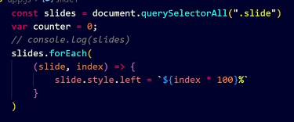
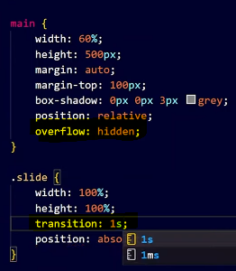
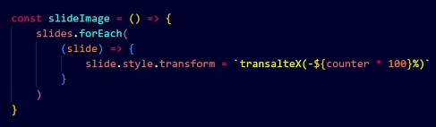
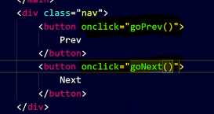
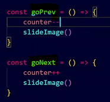
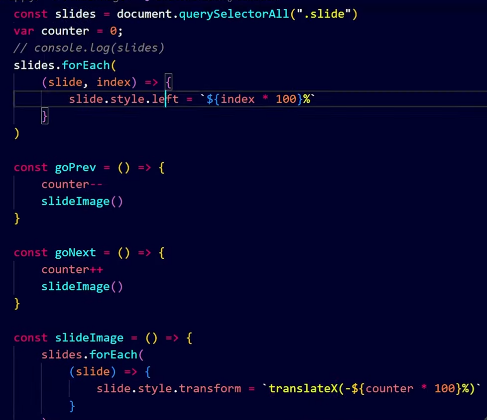

Custom Carousel || Image Slider
We have a Prev | Next button. On pressing it we can move images

Our HTML looks like

One way to center a div withour using flex is, give marginTop and margin:auto

When we give position: absolute to a child, we should give position: relative to the parent also

We write our JS

We select all slides and we run a loop
Now for each slide

Now it results in

To hide this we keep overflow: hidden and we give transition:1s to slide

Now we make a slideImage() which slides image to next based on a counter

Now we give onclick to prev and next button and on pressing them we change value of counter

Complete JS logic

Now if we want it to slide from top to bottom, Instead of "left" we give "bottom" and instead of translateX we give translateY
