AutoComplete Search Bar using JS
We write anything, we get all search terms related to that search text

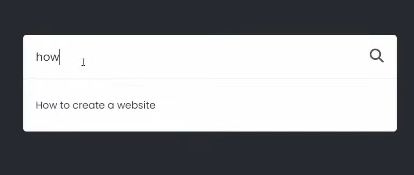

Our HTML looks like

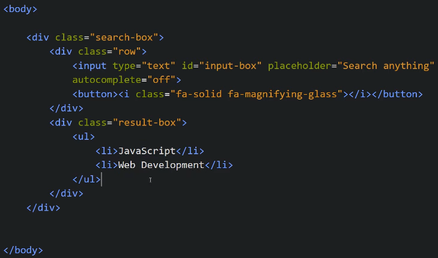

Our JS looks like

We will show the result-box content using JS so initially we delete it

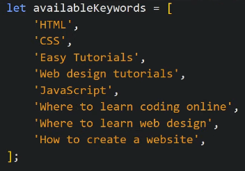

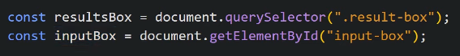

Now we apply "onKeyup" event on the input box, we make an empty array "result" and we store the matching keyword in that array

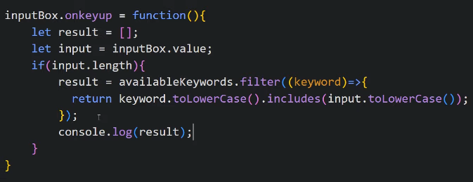

Now we will display that result inside result-box and we pass "result" array as an parameter

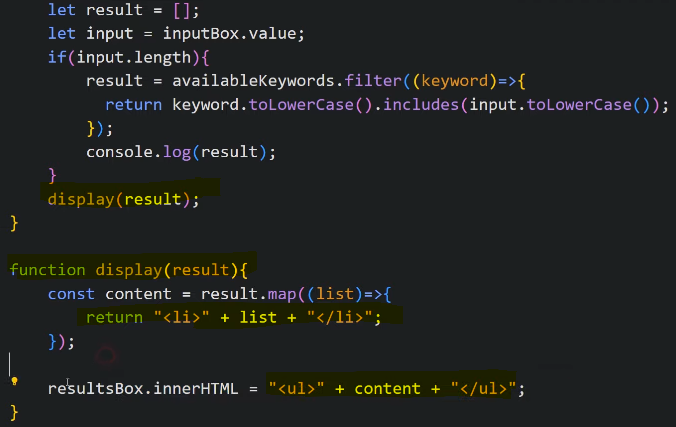

We see in our result, we have "," after each result and our result.map gives another array due to which "," comes, so to convert it to string we use .join and to remove "," we do .join('')

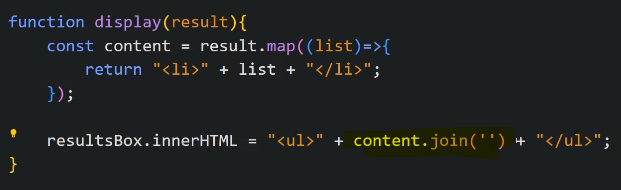

Now if we click on any result option, it should get displayed on the search bar content and hide all other result options so we put onclick on <li>

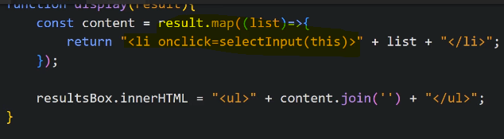

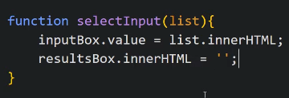

At the end, if our result list is empty, we do not want to show anything in result-box so

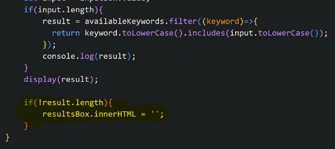

If our Suggestion box is very large, we need to take care of the scroll so

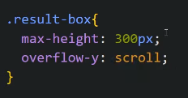
