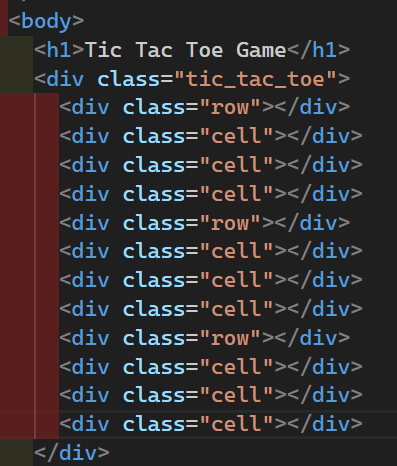
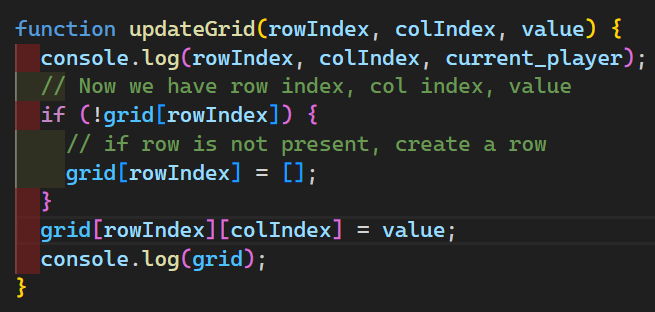

Make a Tic Tac Toe game (Zero kata)
Diagnol also allowed
2 player game
3X3 Game

Use Vanilla JS

Use VSCODE

You have 40-45 minutes

We cannot hardcode the data of matrix size like below

We need to take the input from user for grid size

Now we need to add Event listeners in each cell such that there happens some activity on clicking each cell

Below we can see that we have made a performance mistake like we have created event listener for each cell, if we have 6X6 matrix then there will be 36 event listeners so we can think of event bubbling here

To Optimise it we use this logic below and comment the above addEventListener Logic

To make a winner, we can either access DOM directly and iterate over whole row and col to check it or we can store data in a 2D array, everytime we play we add that info related to that row and col to the 2D array

To get data for particular row or col, we add some attribute to each cell while we are creating it.

Everytime we make cell, we have added setAttribute in each cell where we can access these attributes using dataset, naming convention for giving setAttribute is. Use "data-" prefix and name
like "data-row" means add attribute row
now we access this row using e.target.dataset.row

Now we update the grid using below logic

To check winner diagnolly

Winner logic

We can also put everything inside single loop also

Time complexity of Array Methods in JS: https://dev.to/lukocastillo/time-complexity-big-0-for-javascript-array-methods-and-examples-mlg

How to optimise the getWinner solution to O(n) or O(1)
We can think of Hashmap because adding, deleting or accessing a element in hashmap is O(1)

We will make hashmap for row, col, front_diagnol, reverse_diagnol

row[0] = tells how many same looking element in 0th row
row[1] = tells how many same looking element in 1st row
col[1] = tells how many same looking element in 1st col
front_diagnol and reverse_diagnol similalry
if that number in any of row,col,diag === grid length
we have a winner

Let say we have 3 elements in an array we want to get any random value from any 3 of them, how to do it?
we will use
const value = Math.floor(Math.random()\*10) % 3;
now we use options[value]
