This is a Quiz app which has Questions, right/wrong answer using colours, next button, score display after quiz finishes

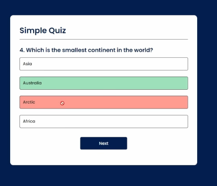

Lets code it

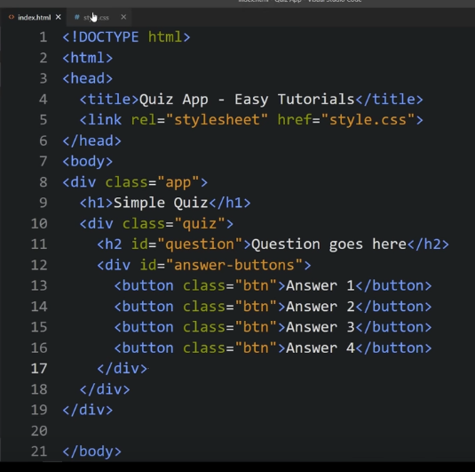

Now we give CSS to html file

Now we add next button which will only be shown when we click any answer so initially we put display:none for the button

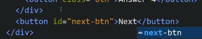

Now we insert JS and connect it to html at end of body tag

We make a JSON for Questions and answers

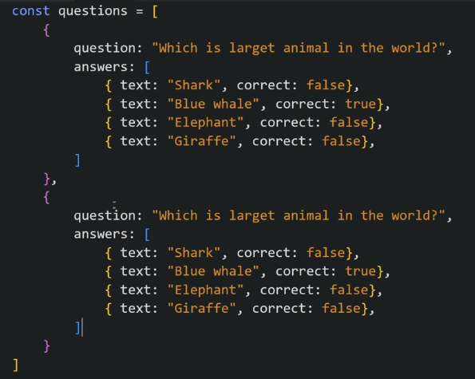

Now we make variables for answer button, question button, next button

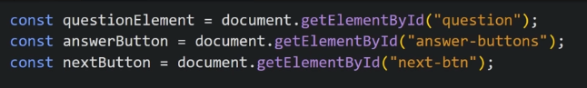

Now we make startQuiz() function which resets the questions index and score

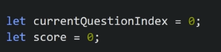

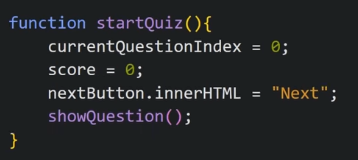

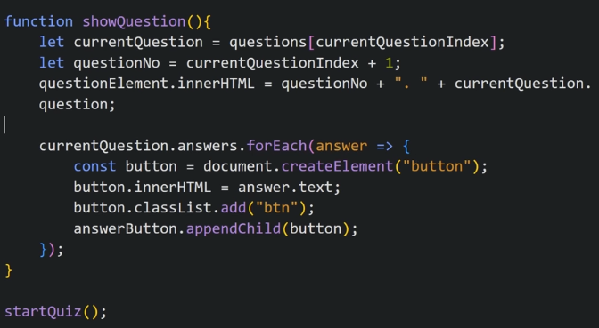

Now we make functionality of what will happen if we click on any answer option

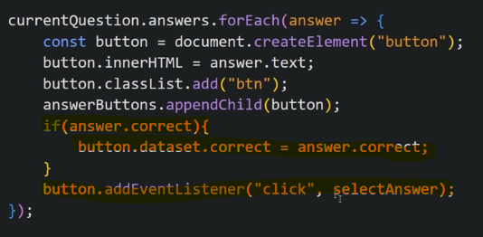

We define selectAnswer function

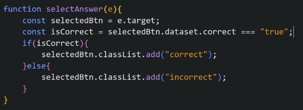

Now we add background colour based on these classes

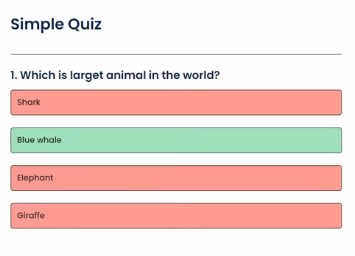

We need to disable number of times a answer can be clicked for an question to 1 and when we select the wrong answer, it should automatically highlight right answer with green colour and show next button

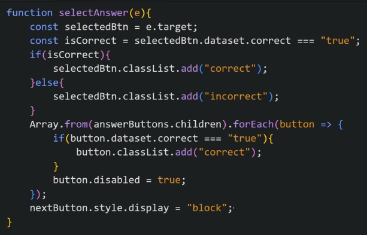

To stop the hover effect once button is disabled and stop cursour pointer, we make following changes in css file

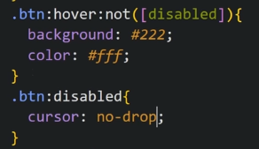

Now when we click correct answer, score should increase

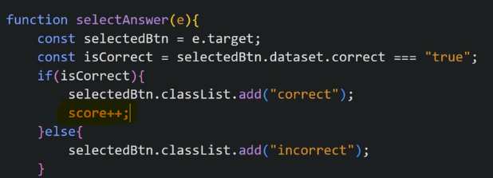

Now we add functionality for next button such that if questions are over, reset the quiz else go to next question

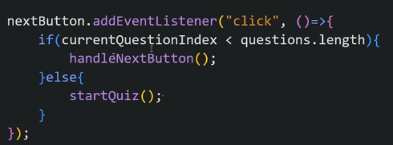

Now we define handleNextButton

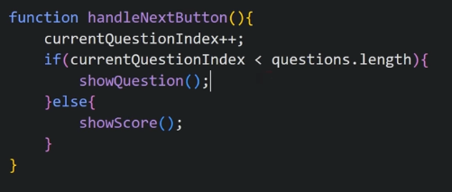

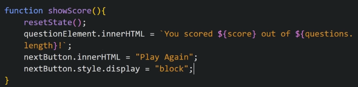
