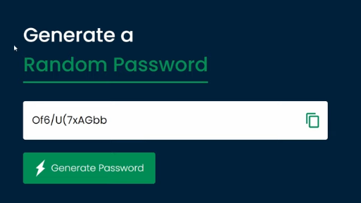
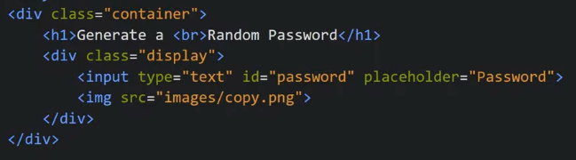
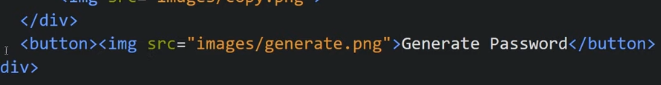
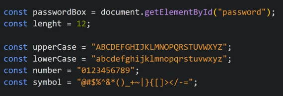
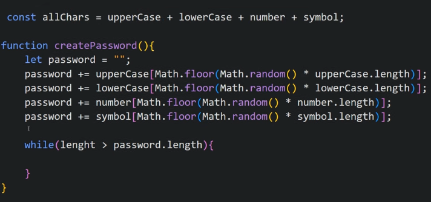
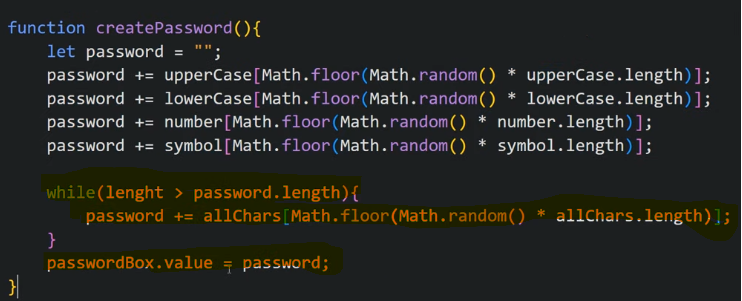
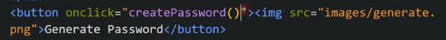
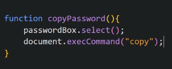

It will display any random password whenever we click "Generate Password" and we can copy it also by pressing button, it will be a strong password

HTML looks like

Adding Generate Password Button

Now we add JS

Now we make a function that creates random password

Math.random\*uppercase.length generates any random number between 0 to uppercase.length that is 26
Now we need length of password to be 12 so we make a while loop and we make allchars variable

Once password is made, we can display it now

We put this function for onclick of generate password button

Now we make copy button functional and create a function that goes to onclick of that button

