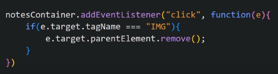

When we click on Create NOtes button, a text box opens where we can write any note, now when we click delete button, it deletes the note.
Now if we close the browser, we again open it, our notes are intact because we have used local storage to store the notes

HTML structure of our doc looks like

Inside p tag we make contentEditable = true

We position delete button at end corner of input tag

Now we do not want input to show by default, we show it using JS when we press the button

So we write JS

To make Delete button functional

Now we want to save these note in our local storage so that everytime we refresh browser, notes remain there

Now we call it, Whenever we add a note or start typing, it should update local storage

Now we need to function to display notes and we call that function at the top

Now we overwrite default behaviour of "Enter" key and whenever we press "Enter" it puts line break in the note

Output looks like

