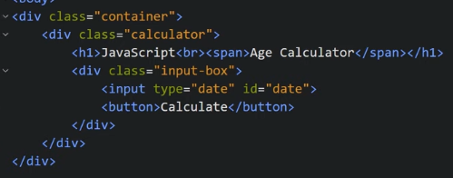
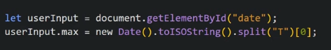
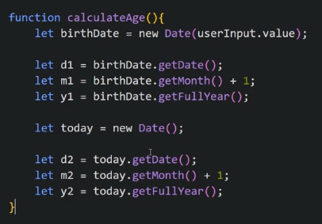
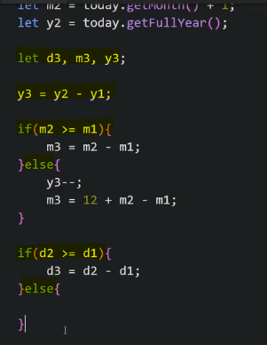
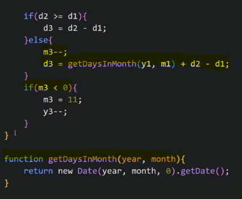
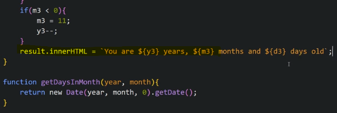

We have a date picker, when we click Calculate, it gives us our age in years, months and days

Our HTML looks like

Let us write JS

We need to make a condition that we can only choose date till today, not in future

Now to calculate age so we make a function for it. we do getMonth + 1 because month start from 0

We find the difference and show it

To get exact number of days

Now we make a p tag in HTMl to show the result

