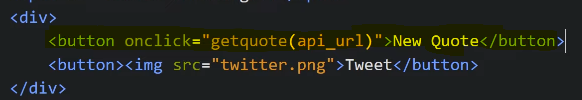

This is a Quote Genertor which Shows new Quotes and let us tweet that quote also on pressing button. The quote data comes from an API.

Our HTML looks like

To Make the box look at the center we give following CSS

To show the blue line we give following CSS

To show " " Quotes we use this CSS

Now we write JS

Our API Data looks like

To make our New Quote button work

Now we make Tweet Button Functional. For that we use twitter API

It opens a dialog box like this on pressing Tweet Button. We make tweet() function and give it as onclick to the button

